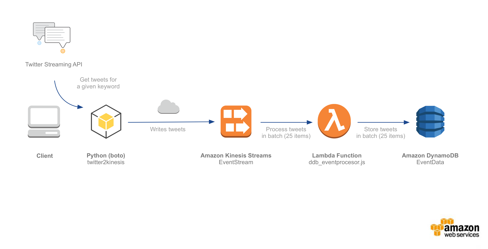

# Serverless Reference Architecture: Real-time Stream Processing
README Languages:  [DE](README/README-DE.md) | [ES](README/README-ES.md) | [FR](README/README-FR.md) | [IT](README/README-IT.md) | [JP](README/README-JP.md) | [KR](README/README-KR.md) |
[PT](README/README-PT.md) | [RU](README/README-RU.md) |
[CN](README/README-CN.md) | [TW](README/README-TW.md)

You can use [AWS Lambda](http://aws.amazon.com/lambda/) and Amazon Kinesis to process real-time streaming data for application activity tracking, transaction order processing, click stream analysis, data cleansing, metrics generation, log filtering, indexing, social media analysis, and IoT device data telemetry and metering. The architecture described in this [diagram](https://s3.amazonaws.com/awslambda-reference-architectures/stream-processing/lambda-refarch-streamprocessing.pdf) can be created with an AWS CloudFormation template.

[The template](https://s3.amazonaws.com/awslambda-reference-architectures/stream-processing/template.yaml)
does the following:

-   Creates a Kinesis Stream

-   Creates a DynamoDB table named &lt;stackname&gt;-EventData

-   Creates Lambda Function 1 (&lt;stackname&gt;-DDBEventProcessor)
    which receives records from Kinesis and writes records to the
    DynamoDB table

-   Creates an IAM Role and Policy to allow the event processing Lambda
    function read from the Kinesis Stream and write to the DynamoDB table

-   Creates an IAM user with permission to put events in the Kinesis stream
    together with credentials for the user to use in an API client

## Instructions

Step 1 - To access the Twitter API you need to get [access tokens](https://dev.twitter.com/oauth/overview/application-owner-access-tokens). Make sure you have these available. As a best practice, we are NOT hard coding these credentials in our Lambda functions. Instead, we are using AWS SSM Parameter Store to store them, and get them from within the Lambda code. The Lambda code expects the parameters named as below:

```
/twitter/consumer_key
/twitter/consumer_secret
/twitter/access_token_key
/twitter/access_token_secret
```

You can add these parameters manually by going to AWS Systems Manager > Parameter Store on the AWS Web Management Console, or by running the below commands on the AWS CLI. Note: make sure the credentials you are using in your CLI are allowed to perform the `ssm put-parameter` API call. For more information on setting up your IAM user permissions for Systems Manager Parameters, see here: [Control Access to Systems manager Parameters](https://docs.aws.amazon.com/systems-manager/latest/userguide/sysman-paramstore-access.html)

```
aws ssm put-parameter --name "/twitter/consumer_key" --value "xxx" --type "SecureString"
aws ssm put-parameter --name "/twitter/consumer_secret" --value "yyy" --type "SecureString"
aws ssm put-parameter --name "/twitter/access_token_key" --value "zzz" --type "SecureString"
aws ssm put-parameter --name "/twitter/access_token_secret" --value "jjj" --type "SecureString"
```

Step 2 - Upgrade (or install) the AWS SAM CLI

```bash 
pip install --upgrade pip --user
hash -r
pip install --upgrade aws-sam-cli --user
```

Step 3a - Build and Deploy the Application Stack using SAM CLI

```bash
sam build && sam package --s3-bucket <your-bucket-name> --output-template-file packaged.yaml --region us-east-1
sam deploy --template-file ./packaged.yaml --stack-name <stack-name> --capabilities CAPABILITY_IAM CAPABILITY_NAMED_IAM CAPABILITY_AUTO_EXPAND
```

Step 3b -  Create an AWS CloudFormation stack with [the
template](https://s3.amazonaws.com/awslambda-reference-architectures/stream-processing/template.yaml). The AWS CloudFormation template completely automates the building, deployment, and configuration of all the components of the application.

[](https://console.aws.amazon.com/cloudformation/home?region=us-east-1#/stacks/new?stackName=lambda-refarch-streamprocessing&templateURL=https://s3.amazonaws.com/awslambda-reference-architectures/stream-processing/template.yaml)

## Validation



Step 1 - 

Step 2 - In the Amazon DynamoDB management console, select the table named `&lt;stackname&gt;-EventData` and explore the records.

## Cleanup

To remove all created resources, delete the AWS CloudFormation stack.