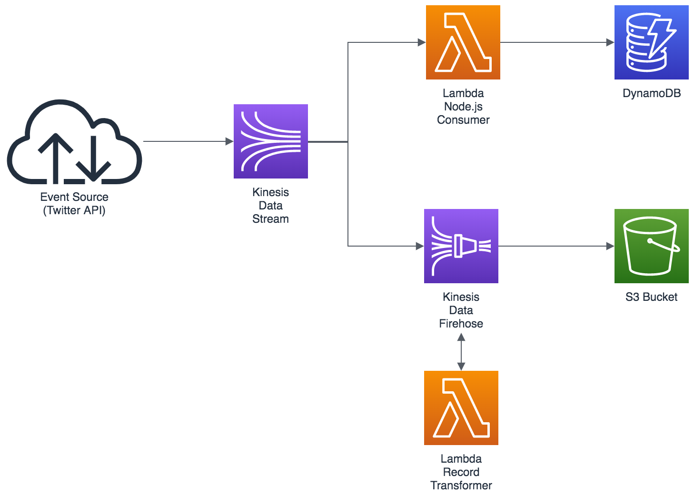

# Serverless Reference Architecture: Real-time Stream Processing
README Languages:  [DE](README/README-DE.md) | [ES](README/README-ES.md) | [FR](README/README-FR.md) | [IT](README/README-IT.md) | [JP](README/README-JP.md) | [KR](README/README-KR.md) |
[PT](README/README-PT.md) | [RU](README/README-RU.md) |
[CN](README/README-CN.md) | [TW](README/README-TW.md)

You can use [AWS Lambda](http://aws.amazon.com/lambda/) and Amazon Kinesis to process real-time streaming data for application activity tracking, transaction order processing, click stream analysis, data cleansing, metrics generation, log filtering, indexing, social media analysis, and IoT device data telemetry and metering. The architecture described in this [diagram](https://s3.amazonaws.com/awslambda-reference-architectures/stream-processing/lambda-refarch-streamprocessing.pdf) can be created with an AWS CloudFormation template.

[The template](https://s3.amazonaws.com/awslambda-reference-architectures/stream-processing/template.yaml)
does the following:

-   Creates a Kinesis Stream

-   Creates a DynamoDB table named &lt;stackname&gt;-EventData

-   Creates Lambda Function 1 (&lt;stackname&gt;-DDBEventProcessor)
    which receives records from Kinesis and writes records to the
    DynamoDB table

-   Creates an IAM Role and Policy to allow the event processing Lambda
    function read from the Kinesis Stream and write to the DynamoDB table

-   Creates an IAM user with permission to put events in the Kinesis stream
    together with credentials for the user to use in an API client

## Instructions

Step 1 -  Create an AWS CloudFormation stack with [the
template](https://s3.amazonaws.com/awslambda-reference-architectures/stream-processing/template.yaml). The AWS CloudFormation template completely automates the building, deployment, and configuration of all the components of the application.

[](https://console.aws.amazon.com/cloudformation/home?region=us-east-1#/stacks/new?stackName=lambda-refarch-streamprocessing&templateURL=https://s3.amazonaws.com/awslambda-reference-architectures/stream-processing/template.yaml)

Step 2 - Once the AWS CloudFormation stack has successfully been created you can do select the Outputs tab and see the AWS parameters needed in the demo Twitter client in the steps below.

Step 3 - To run the example application you need to update the code with AWS and Twitter information. Open producer/twitter2kinesis.py in a text editor.

Step 4 - To access the Twitter API you need to get [access tokens](https://dev.twitter.com/oauth/overview/application-owner-access-tokens). Make sure you have these available. As a best practice we are not hard coding these credentials in our Lambda functions. Instead, we are using AWS SSM Parameter Store to store them, and get them from within the Lambda code. The Lambda code expects the parameters named as below:

```
/twitter/consumer_key
/twitter/consumer_secret
/twitter/access_token_key
/twitter/access_token_secret
```

You can add these parameters manually by going to AWS Systems Manager > Parameter Store on the AWS Web Management Console, or using the it's easier to add them using below commands on the AWS CLI, make sure the credentials you are using in your CLI are allowed to perform the ```put-parameter``` and API call.

```
aws ssm put-parameter --name "/twitter/consumer_key" --value "xxx" --type "SecureString"
aws ssm put-parameter --name "/twitter/consumer_secret" --value "yyy" --type "SecureString"
aws ssm put-parameter --name "/twitter/access_token_key" --value "zzz" --type "SecureString"
aws ssm put-parameter --name "/twitter/access_token_secret" --value "jjj" --type "SecureString"
```

Step 5 - Enter the values for the AWS credentials and Amazon Kinesis stream name. This is the information from the Outputs tab of the CloudFormation template you got in step 2:

AWS parameters - from the Outputs tab of the CloudFormation template
```
access_key = ""
secret_access_key = ""
region = ""
stream_name = ""
```

Step 6 - Finally, before running the example code, you need [Python](https://www.python.org/) installed together with the Python modules boto3 and TwitterAPI. If you don't have the modules already, install them using [pip](http://pip.readthedocs.org/en/stable/installing/):

```
pip install -r requirements.txt
```

## Test



Step 1 - Run the producer/twitter2kinesis.py Python application from the command line to start sending tweets into the Kinesis stream.

```
python twitter2kinesis.py
```

Step 2 - In the Amazon DynamoDB management console, select the table named &lt;stackname&gt;-EventData and explore the records.

## Cleanup

To remove all created resources, delete the AWS CloudFormation stack.


## Update SAM 

```bash 
pip install --upgrade pip --user
hash -r
pip install --upgrade aws-sam-cli --user
```

## Kinesis Producer as Lambda

```bash
sam build -t producer-template.yaml
sam package --s3-bucket <your-bucket-name> --output-template-file producer-template-packaged.yaml
sam deploy --template-file producer-template-packaged.yaml --stack-name <stack-name> --capabilities CAPABILITY_IAM
```
